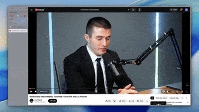

# YT-Scribe

A **Neo-Brutalist** YouTube Transcript Extractor. Paste a YouTube URL, extract captions in any available language, search, copy, or download as `.txt` / `.json`.



## Tech Stack

- **Astro** v6 (SSR with Node adapter)
- **Tailwind CSS** v4 via `@tailwindcss/vite`
- **youtube-transcript** (npm) + InnerTube API / HTML scraping fallbacks
- **Neo-Brutalist** design system (see [DESIGN.md](./DESIGN.md))

## Getting Started

```bash
# Install dependencies
npm install

# Start the dev server (http://localhost:4321)
npm run dev

# Production build
npm run build

# Preview the production build
npm run preview
```

Requires **Node.js >= 22.12.0**.

## Usage

1. Open the app in your browser
2. Paste a YouTube video URL (watch, Shorts, live, or embed)
3. Select a language if captions are available in multiple languages
4. View the transcript in **Timeline** or **Plain Text** mode
5. Click a timestamp line to open the video at that moment
6. Search within the transcript, copy to clipboard, or download

## API

`POST /api/transcript`

```json
{ "url": "https://www.youtube.com/watch?v=...", "lang": "en" }
```

Returns `{ videoId, title, languageCode, languageName, lines[], availableLanguages[] }`.

## Project Structure

```
src/
├── pages/
│   ├── index.astro         # Main SPA page
│   └── api/
│       └── transcript.ts   # Transcript extraction API
├── layouts/
│   └── Layout.astro        # HTML shell + fonts
├── styles/
│   └── global.css          # Tailwind + Neo-Brutalist tokens
└── assets/                 # Static images
```

## Design

This project follows a **NEO-UI** Neo-Brutalist design language defined in `DESIGN.md` — heavy borders, solid shadows, high contrast, and a warm neutral palette.
